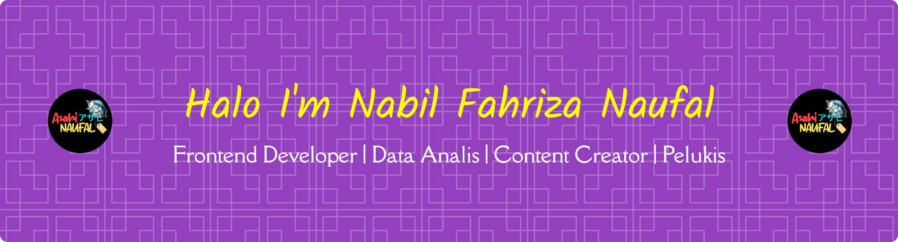

##### I'm a student at Digital Technology University Indonesia

---

## 🚀 About Me
- 🌱 Saat ini sedang mendalami **Data Analis**
- 💻 Suka membangun aplikasi yang **clean, scalable, dan useful**
- 🧠 Percaya bahwa *learning never stops*
- 📍 Based in Indonesia

---

## 🛠️ Tech Stack
   

 

**Others**

---

## 📊 GitHub Stats

  
  

---

## 📌 Featured Projects
- 🔹 **Project A** – Deskripsi singkat project  
- 🔹 **Project B** – Masalah yang diselesaikan & teknologi  
- 🔹 **Project C** – Highlight fitur utama

---

## 🌐 Socials
- 💼 LinkedIn: [linkedin.com/in/username](https://linkedin.com)
- 📫 Email: nabilfahriza20@gmail.com
- 
- 🌍 Portfolio: coming soon

